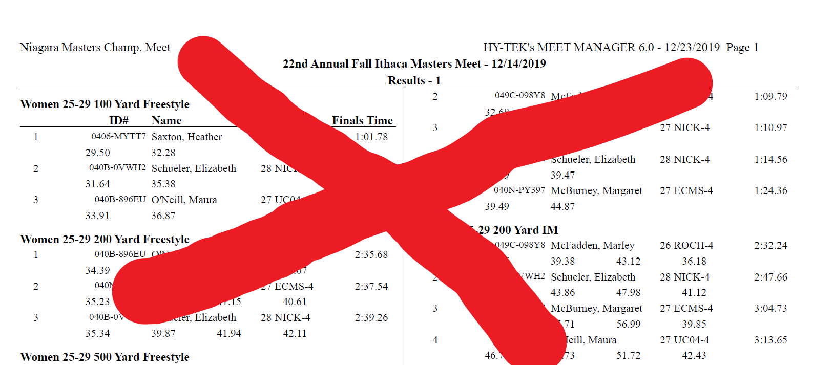

# 'SwimmeR'

'SwimmeR' is intended to assist those working with times from competitive pool swimming races, such as those conducted under the NHFS, NCAA, or FINA.  For more information please see `vignette("SwimmeR")`.

# Usage

Version 0.2.0.0 of `SwimmeR` has two major uses - importing results and formating times

## Importing Results

`SwimmeR` reads swimming results into R and outputs tidy dataframes of the results.  `SwimmeR` uses `Read_Result` to read in either a PDF or HTML file (like a url) and the `Swim_Parse` to convert the read file to a tidy dataframe.

`Read_Result` has two arguements, `file`, which is the file path to read in, and `node`, required only for HTML files, this is a CSS node where the results reside

`Swim_Parse` has four arguements. `file` is the output of `Read_Result` and is required.  `avoid` is a list of strings.  Rows of the read in file containing any of those strings will not be included.  `avoid` is optional.  Incorrectly specifying it may lead to nonsense rows in the final dataframe, but will not cause an error.  `typo` and `replacement` work together to fix typos, by replacing them with replacements.  Strings in `typo` will be replaced by strings in `replacement` in element index order - that is the first element of `typo` will be replaced everywhere it appears by the first element of `replacement`.  Typos can cause lost data and nonsense rows.  See `?Swim_Parse` or the package Vignette for more information.

```r
Swim_Parse(
    Read_Results(
      "http://www.nyhsswim.com/Results/Boys/2008/NYS/Single.htm",
      node = "pre"
    ),
    typo = c("-1NORTH ROCKL"),
    replacement = c("1-NORTH ROCKL")
  )
```

`SwimmeR` can only read files in single column format, not double.  `SwimmeR` also does not capture split times.

### Will not work


### Will work


### Will also work


## Formatting Times

`SwimmeR` also converts times between the conventional swimming format of minutes:seconds.hundreths (1:35.37) and the computationally useful format of seconds, reported to the 100ths place (eg 95.37).  This is accomplished with `sec_format` and `mmss_format`, which are inverses of one another.  Both `sec_format` and `mmss_format` work well with `tidyverse` functions.

```r
times <- c("1:35.97", "57.34", "16:53.19", NA)
times_sec <- sec_format(times)
times_sec
times_mmss <- mmss_format(times_sec)
times_mmss
all.equal(times, times_mmss)
```
### Course conversions

Additionally 'SwimmeR' also converts between the various pool sizes used in competitive swimming, namely 50m length (LCM), 25m length (SCM) and 25y length (SCY).  This is accomplished with either `convert_courses` or `convert_courses_DF`, both of which have the same basic functionality.  The difference is the `convert_courses_DF` returns a dataframe including the input variables whereas `convet_courses` only returns the converted time(s).  Both functions will take inputs in either seconds or swimming format.

```r
Swim <- tibble(time = c("6:17.53", "59.14", "4:14.32", "16:43.19"), course = c("LCM", "LCM", "SCY", "SCM"), course_to = c("SCY", "SCY", "SCM", "LCM"), event = c("400 Free", "100 Fly", "400 IM", "1650 Free"))

course_convert(time = Swim$time, course = Swim$course, course_to = Swim$course_to, event = Swim$event)

course_convert_DF(time = Swim$time, course = Swim$course, course_to = Swim$course_to, event = Swim$event)
```

## Getting help
For more information please see `vignette("SwimmeR")`.  If you download from github don't fotget to set `build_vignettes = TRUE`.

If you find bug, please provide a minimal reproducible example at [github](https://github.com/gpilgrim2670/SwimmeR). For questions please contact the [creator](gpilgrim2670@gmail.com)
